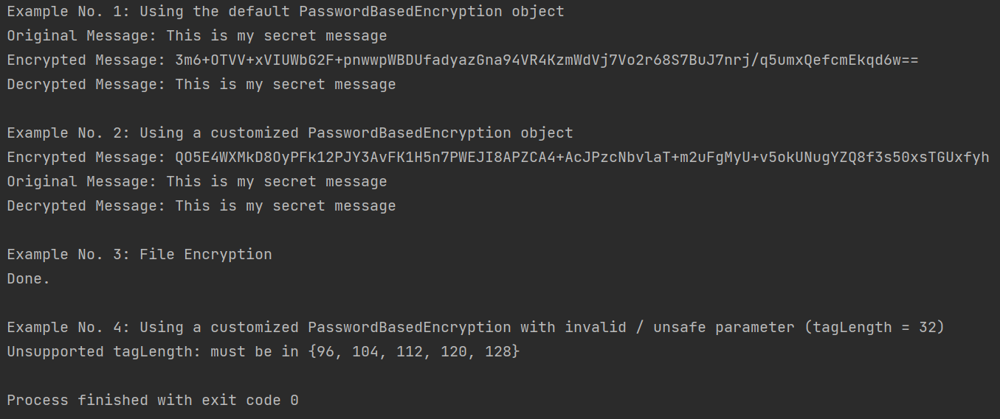

# Password Based AES-GCM Encryption
This best-practice example is part was written as part of the "Anleitung zu wissenschaftlichem Arbeiten"
of my Bachelor Thesis.
I conducted my project in the Software Composition Group at the University of Bern during the automn semester 2021.
I was supervised by Dr. Mohammad Ghafari and Mohammadreza Hazhirpasand.

The example code should be used for educational purpose only.
For further explanations, have a look at chapter 6 of my thesis.

## Requirements
The project should run on any Java platform provided that suitable Providers are available.
We built and ran the project on Java 15.0.1 using the platforms default provider (SunJCE, version 15)

## Set Up the Project
1. Download or pull the thesis repository to your local device.
2. Use your favorite IDE to open the *code* directory as a project.
3. Run main method located in Main.java. 
Examples 1, 2, and 3 should run without throwing an error.

The output in the terminal should be:


## Use PasswordBasedAesGcm Class
The class provides a static getInstance() method for object instantiation.
You can create an object by calling it
```
PasswordBasedAesGcm crypto = PasswordBasedAesGcm.getInstance();
```
Afterwards, you can configure the object using the setter methods, i.e.
```
crypto.setKeyLength(256);
```
The class provides method to perform password based 
encryption and decryption of Strings and files.
Have a look at the example methods in Main class.